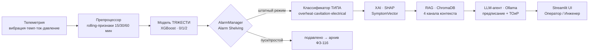
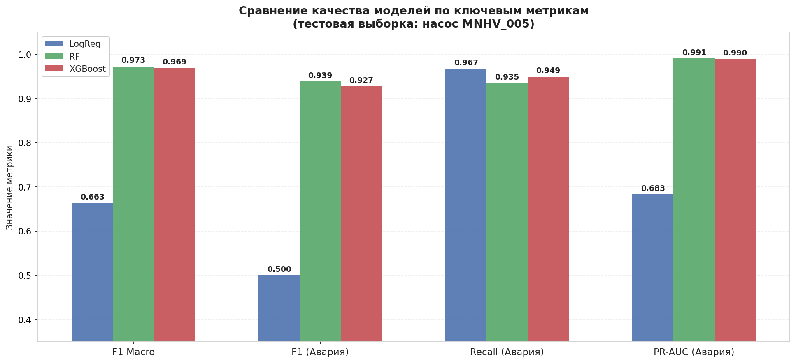
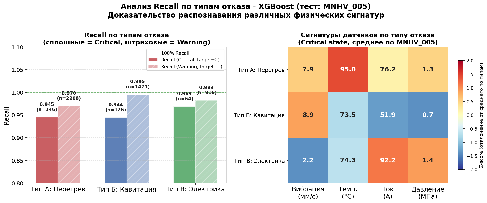
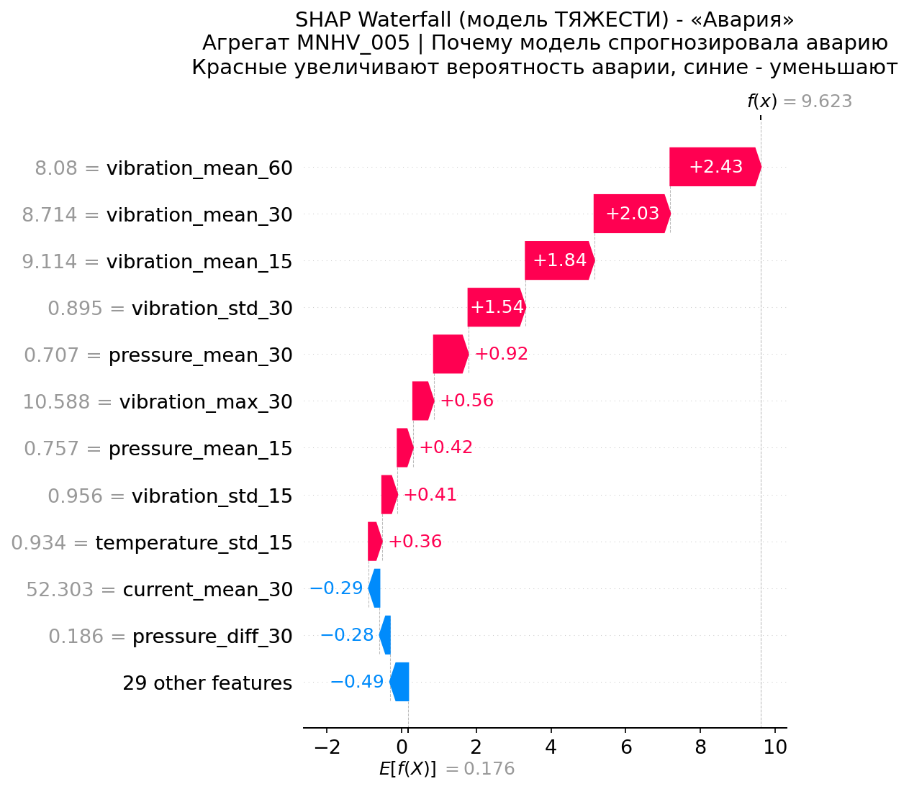
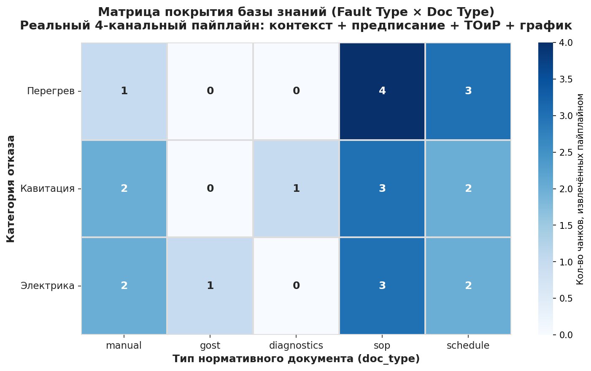
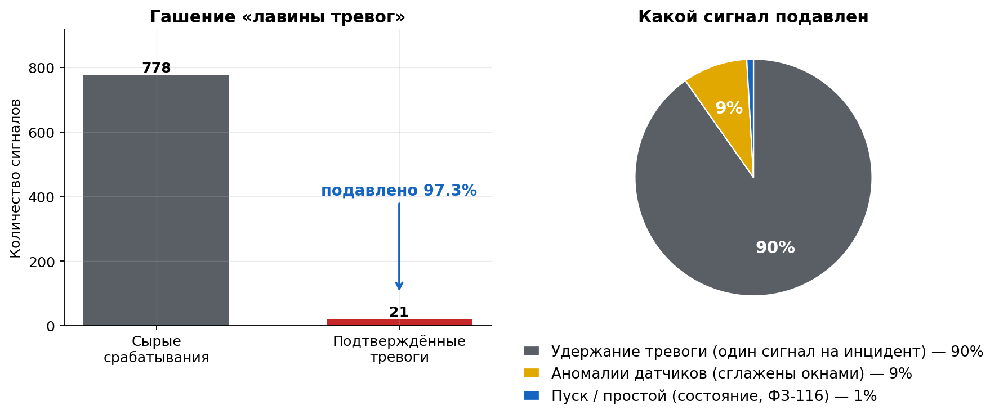
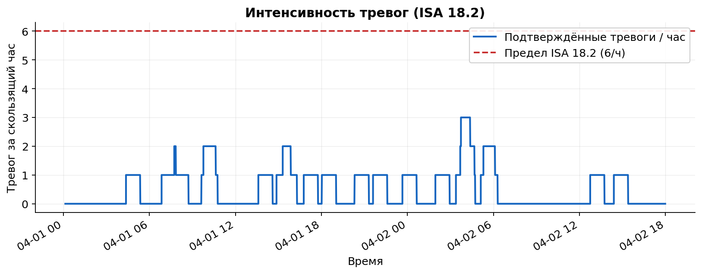

# Predictive Alarm Platform

**Платформа предиктивного управления аварийными сигналами для насосного оборудования нефтегазовой отрасли.**

Телеметрия агрегата → подавление ложных тревог → классификация состояния → объяснение решения (XAI) → текстовое предписание оператору от LLM-агента на основе нормативной документации. Всё — в двухуровневом дашборде по стандарту NAMUR NE 129.


-555555)


> ✅ **Статус проекта.** Платформа функционально завершена (магистерская диссертация, Иннополис, 2026): аналитическое ядро (две модели + XAI), RAG, LLM-агент, runtime-слой и двухуровневый дашборд с двумя источниками данных — **демо из датасета** и **живой режим реального времени** — реализованы и валидированы. Есть подсистема real-time валидации с публикационными графиками (в т.ч. «лавина тревог»). Дальше — косметика (полировка UI, графики, комментарии) и **валидация на реальных промышленных данных** (текущая выполнена на физически достоверном синтетическом датасете и живом генераторе парка).

---

## Предпосылки разработки

На реальной установке оператор тонет в потоке аварийных сигналов: пусковые токи, гидроудары, дребезг датчиков порождают сотни ложных тревог в сутки (проблема *alarm flooding*, регулируемая ANSI/ISA-18.2). Критический сигнал теряется в шуме.

Платформа решает три задачи одновременно:

| Проблема | Решение |
|---|---|
| Авария замечается поздно, по факту срабатывания порога | **Предиктивная** классификация ловит статистическую сигнатуру дефекта _до_ выхода за порог ГОСТ |
| Поток ложных тревог в пусковых/нерабочих режимах | **Alarm Shelving** — контекстная фильтрация поверх ML (state-based alarming) |
| «Чёрный ящик» не вызывает доверия у инженера | **SHAP** показывает вклад каждого признака; **LLM-агент** выдаёт предписание со ссылкой на норматив |

---

## Архитектура



**Иерархическая классификация в два этапа:** сначала определяется *тяжесть* состояния (Норма / Предупреждение / Авария), затем — *физический тип* отказа. Это разделяет «насколько опасно» и «что именно сломалось» — две разные инженерные задачи.

**Runtime-слой** (`src/runtime/`) отделяет дашборд от ядра: дебаунс-автомат тревог (`PumpAlarmFSM`) гейтит запуск тяжёлой цепочки `XAI→RAG→агент` — она срабатывает раз на подтверждённую эскалацию, а не на каждый тик.

---

## Ключевые результаты

### Модель тяжести (XGBoost, тест на _неисследованном_ насосе MNHV_005)

| Метрика | Значение |
|---|---|
| **F1-Macro** | **0.97** |
| **Recall (Авария)** — главный KPI | **0.949** |
| **PR-AUC (Авария)** | **0.990** |

> Обобщение доказано через **Group Split** (обучение на 4 насосах, тест на 5-м) и **LOGO-CV** по 5 фолдам — результат не привязан к конкретному тестовому агрегату.

<table>
<tr>
<td><br/><sub>Сравнение моделей: LR / RF / XGBoost</sub></td>
<td><br/><sub>Recall по трём типам отказа — модель различает физические сигнатуры</sub></td>
</tr>
</table>

### Классификатор типа отказа (вторая модель, тест на _неисследованном_ MNHV_005)

| Модель | macro-F1 | balanced acc | Recall Перегрев | Recall Кавитация | Recall Электрика |
|---|---|---|---|---|---|
| **XGBoost** (основная) | **0.995** | **0.995** | 0.996 | 0.997 | 0.992 |
| Random Forest | 0.993 | 0.992 | 0.995 | 0.997 | 0.985 |
| Logistic Regression (baseline) | 0.974 | 0.976 | 0.978 | 0.980 | 0.969 |

> Иерархия: модель тяжести определяет, _насколько_ опасно (0/1/2), вторая модель — _что именно_ сломалось. Обучаемый классификатор заменил SHAP-эвристику (точность ~0.61 → 0.995).

**Различение физических сигнатур моделью тяжести** — recall по типам отказа доказывает, что модель не работает по правилу «всё выросло → авария»:

| Тип отказа | Recall (Авария) | Recall (Предупреждение) |
|---|---|---|
| 🔥 Перегрев | 0.945 | 0.970 |
| 💧 Кавитация | 0.944 | 0.995 |
| ⚡ Электрика | 0.969 | 0.983 |

### Объяснимость (SHAP) и качество поиска (RAG)

<table>
<tr>
<td><br/><sub>SHAP waterfall: вклад признаков в решение «Авария»</sub></td>
<td><br/><sub>Покрытие базы знаний: тип отказа × тип документа</sub></td>
</tr>
</table>

### Подавление лавины тревог (главное доказательство цели)

Прогон парка в **режиме реального времени** с живым генератором: сколько сигналов выдал бы наивный пороговый алармер — и сколько из них платформа погасила окнами, контекстом состояния и дебаунсом, оставив оператору только подтверждённые тревоги.

<table>
<tr>
<td><br/><sub>Лавина тревог: наивный алармер vs платформа</sub></td>
<td><br/><sub>Темп тревог во времени (норматив ISA 18.2 — ≤6/час)</sub></td>
</tr>
</table>

### Корректность доказана отдельными проверками

- **Permutation test** — при перемешивании меток точность классификатора типа падает к случайной (~1/3): модель учит реальные сигнатуры, а не паразитные паттерны.
- **RAG regression guard** — стадийная и сценарная привязка регламентных предписаний защищена тестами от регрессии при перестройке базы.
- **Защита от утечки данных** — `shift(1)` перед каждым rolling-окном; признаки строки T используют только историю `[T-w … T-1]`.
- **Паритет online == offline** — потоковый препроцессор бит-в-бит совпадает с офлайн-обучением на полном окне; живой режим использует тот же контракт признаков.

---

## Три физических сценария отказа

Датасет смоделирован как **AR(1)-процесс поверх конечного автомата** (5 состояний) с тремя различимыми сигнатурами — модель вынуждена учиться физике, а не правилу «всё выросло → авария»:

| Тип | Доля | Сигнатура |
|---|---|---|
| 🔥 **Перегрев** (overheat) | 55% | температура → 93+°C, сильно возрастает вибрация, ток растёт и волатилен, давление незначительно падает вследствие деградации |
| 💧 **Кавитация** (cavitation) | 30% | вибрация → 8+ мм/с, давление сильно падает и пульсирует |
| ⚡ **Электрика** (electrical) | 15% | значительные скачки тока, при этом вибрация и температура в норме |

Тип «Электрика» специально лишён роста вибрации/температуры — это заставляет модель опираться на токовые признаки, а не на тривиальные корреляции.

---

## Технологический стек

| Слой | Технологии |
|---|---|
| **ML** | scikit-learn, XGBoost |
| **XAI** | SHAP (TreeExplainer) |
| **RAG / Embeddings** | LangChain, ChromaDB, `intfloat/multilingual-e5-large` |
| **LLM** | Ollama (локально, без внешних API) — Qwen 3.5 9B, Phi-4 14B, YandexGPT-5 Lite 8B |
| **UI** | Streamlit + Plotly |
| **Данные** | pandas, numpy |

LLM-агент использует **4-канальный промпт** (справочный контекст / действия оператора / работы ТОиР / график ППР) с противогаллюцинаторным системным промптом: предписание формируется строго из извлечённого контекста со ссылкой на конкретный нормативный документ.

---

## Соответствие нормативной базе

- **ГОСТ 32601-2013** — пороги вибрации и температуры подшипников
- **ANSI/ISA-18.2**, **EEMUA 191** — управление аварийными сигналами, рационализация и дебаунс
- **NAMUR NE 107** — цветовые статусы оборудования в UI
- **NAMUR NE 129** — двухуровневый принцип HMI (оператор / инженер)
- **ФЗ № 116-ФЗ**, **ГОСТ Р 22.1.12-2005** — подавленные сигналы сохраняются в архиве

---

## Структура репозитория

```
src/
├── data/        # генератор данных (AR(1) + FSM) + препроцессор признаков
├── ml/          # модель тяжести, классификатор типа, валидация recall
├── xai/         # SHAP-объяснения, SymptomVector
├── rag/         # ChromaDB, структурный чанкинг регламента (SOP)
├── agent/       # DiagnosticAgent (Ollama), 4-канальный промпт
├── runtime/     # потоковый препроцессор, FSM тревог, backend-адаптер
├── app/         # Streamlit-дашборд (оператор + инженер)
└── visualisation/

experiments/     # LOGO-CV, бенчмарк LLM, permutation test, RAG-guard
config/          # единый источник констант + системный промпт агента
knowledge_base/  # нормативные документы (ГОСТ, мануал, регламент, график ППР)
models/          # severity/ + fault_type/ (LR / RF / XGBoost)
artifacts/       # графики, таблицы, векторная БД (генерируются прогоном)
```

---

## Быстрый старт

```bash
# 1. Окружение
python -m venv .venv && source .venv/bin/activate
pip install -r requirements.txt

# 2. Воспроизвести пайплайн (из корня репозитория)
python -m src.data.data_generator                  # сгенерировать датасет
python -m src.data.data_preprocessor               # rolling-признаки
python -m src.ml.severity_classifier_pipeline      # модель тяжести + метрики
python -m src.ml.fault_classifier_pipeline         # классификатор типа отказа
python -m src.xai.xai_module                        # SHAP-объяснения
python -m src.rag.rag_database                       # собрать базу знаний (ChromaDB)

# 3. Запустить дашборд
streamlit run src/app/app.py
```

В дашборде (левая панель «Сценарий и воспроизведение») доступны **два источника данных**:
- **Датасет (демо)** — детерминированный эпизод `Норма → Предупреждение → Авария` выбранного типа из размеченного датасета (тот же unseen-насос, на котором валидированы модели);
- **Реальное время** — живой генератор парка из 5 насосов со случайными отказами; квитирование возвращает агрегат в работу. Кнопка «Сохранить графики валидации» строит публикационные графики (лавина тревог, латентность, матрица ошибок) в `artifacts/graphs/`.

> LLM-агенту требуется локально запущенный [Ollama](https://ollama.com) с одной из моделей из `config/settings/settings.py`. Дашборд умеет работать в режиме `ProtoBackend` (без Ollama/моделей) для вёрстки и демонстрации.

---

## Дорожная карта

- [x] Генератор физически достоверных данных (AR(1) + State Machine, 3 типа отказа)
- [x] Двухступенчатая ML-классификация с доказанным обобщением (Group Split + LOGO-CV)
- [x] Alarm Shelving (контекстное подавление ложных тревог)
- [x] XAI через SHAP + обучаемый классификатор типа отказа
- [x] RAG-база знаний со структурным чанкингом регламента
- [x] LLM-агент (4-канальный промпт, потоковая генерация, бенчмарк 3 моделей)
- [x] Runtime-слой: FSM тревог, журнал событий, гейтинг LLM
- [x] Двухуровневый Streamlit-дашборд (фоновая генерация, мультистраничная навигация, история событий)
- [x] Живой режим реального времени (генератор парка + прогрессивный препроцессор)
- [x] Подсистема real-time валидации (метрики + публикационные графики, «лавина тревог»)
- [ ] Косметика: полировка UI, графиков, комментариев, чистка контекста
- [ ] **Валидация на реальных промышленных данных**
- [ ] Регрессионный тест паритета online/offline-препроцессора как отдельный модуль

---

<sub>Магистерская дипломная работа · Университет Иннополис · 2026 · «Разработка платформы предиктивного управления аварийными сигналами на основе промышленных данных предприятия нефтегазовой отрасли»</sub>